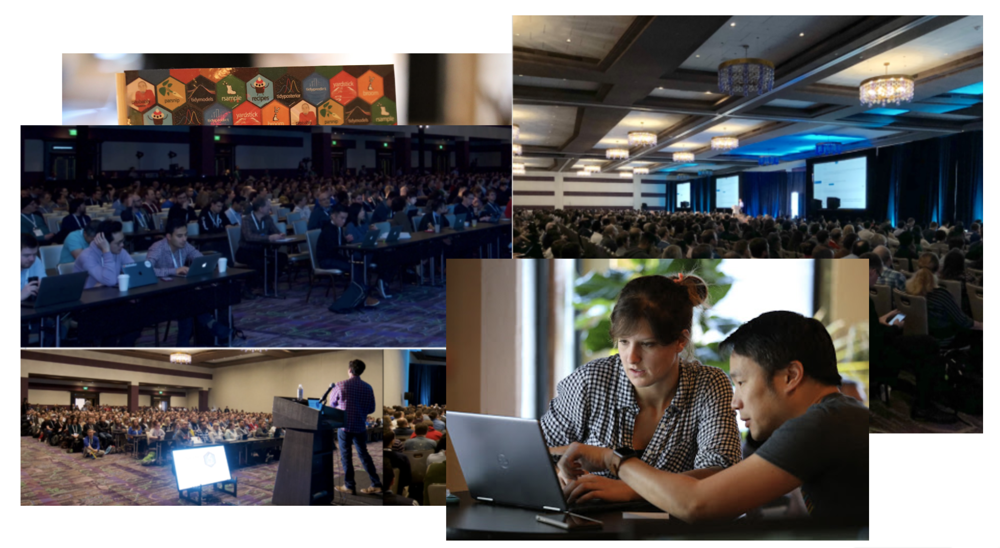
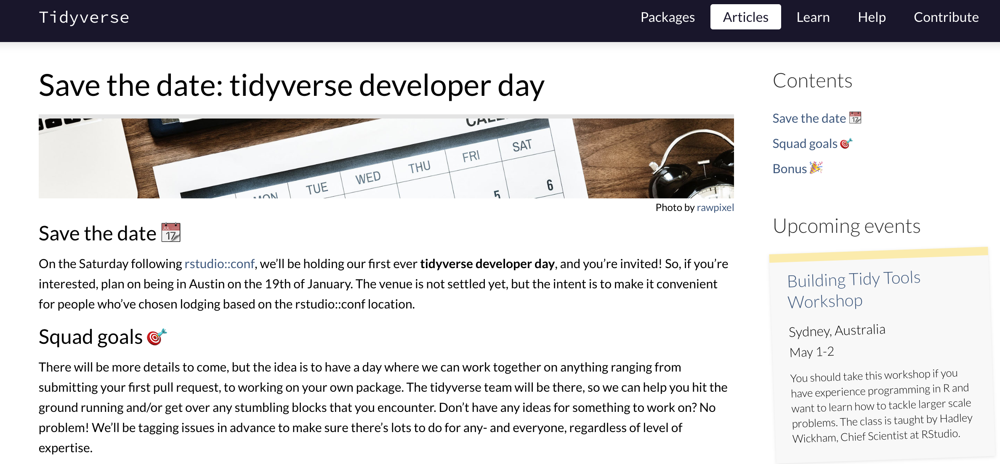
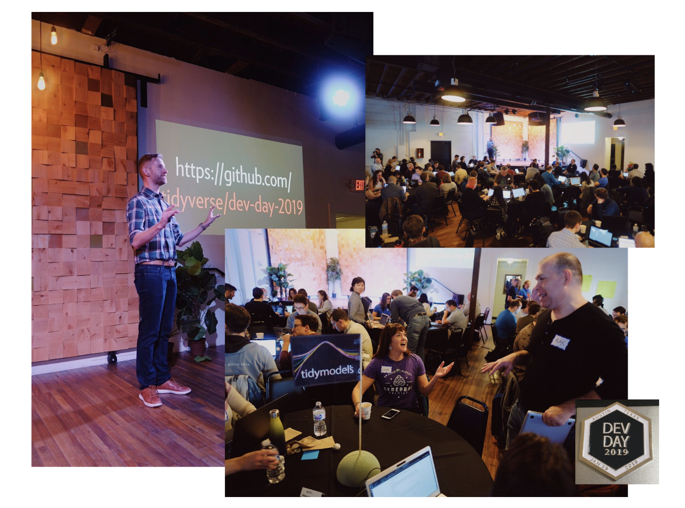
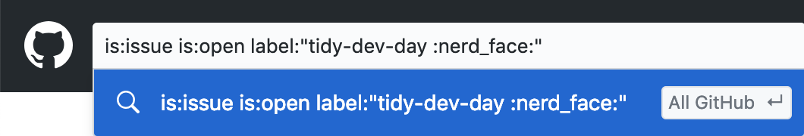
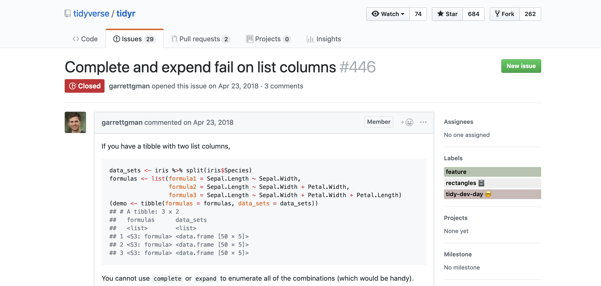
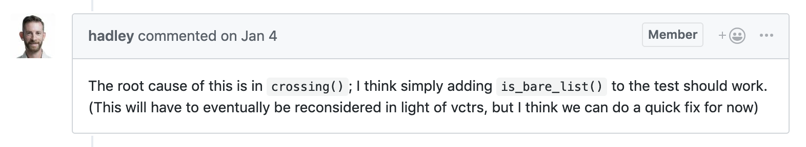
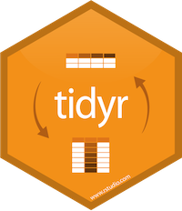
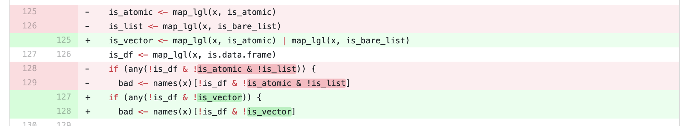
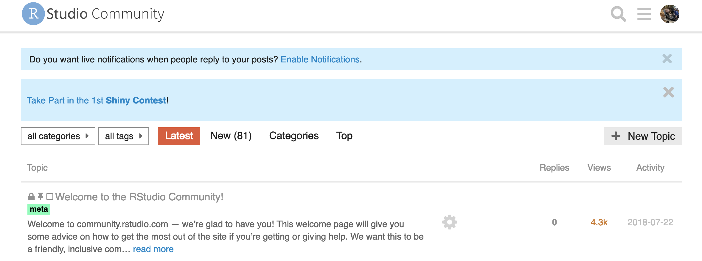
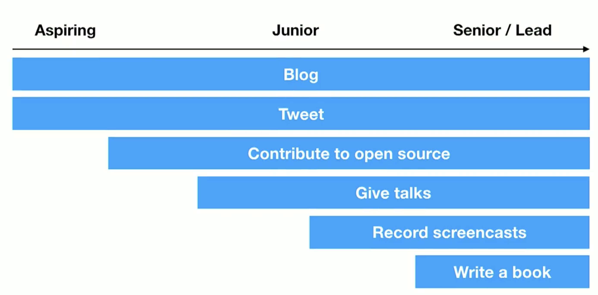

```{r setup, include=FALSE}
options(htmltools.dir.version = FALSE)
```

class: center, middle

# rstudioconf::2019



???
So it all started at rstudioconf.

There were almost 2000 attendees. This is only one talk - there were three others going on at this exact same time - just to give you an idea of scale. 
Everyone was incredibly excited, eager, and friendly. 
---

class: inverse, center, middle


---
# An open source hackathon 



???
Tidyverse developer day was an event organized by the tidyverse team for the day after the conference. The idea was to have a day where anyone interested in contributing to the tidyverse can work together on anything ranging from submitting your first pull request, to working on your own package. 

There were only about 100 or so tickets available and all proceeds were going to a local charity aimed towards teaching STEM to underrepresented youths. 

About two weeks before the conference, the organizers sent out an email to everyone registered with a brief survey. The survey mainly gauged Git and GitHub competency and overall interests (EX. data cleaning, visualization, modeling, tidy eval, etc. )

---

class: center, middle

# How was I feeling?

---

class: inverse, center, middle 

<iframe src="https://giphy.com/embed/xDQ3Oql1BN54c" width="480" height="332" frameBorder="0" class="giphy-embed" allowFullScreen></iframe><p><a href="https://giphy.com/gifs/dog-confused-i-have-no-idea-what-im-doing-xDQ3Oql1BN54c">via GIPHY</a></p>

???
Pretty freaked out. 

Not only was I warn out by the conference (did I mention I did a two-day workshop on building packages?), but I felt completely out of my league. Sure, I knew in theory tidy and git philosophy, but I had only really made a few pull requests before, and none of them were too complicated. In all honesty I debating not going, but I had my encouraging partner with me and I figured I would at least try it out. If it wasn't for me I could leave. At least I would get breakfast tacos. 

So what what it really like?

---

class: center, middle 




???

After going over the code of conduct and introducing everyone on the tidyverse team they explained that we would be primarily working off of tagged issues on GitHub. 

They loosely organized everyone in the room: first time Git and GitHub users would sit on one side of the room and work with Jenny, people interested in modeling would work with Max, dplyr with Romain - but in general everyone was set up at a small table and people would move from table to table often.

The environment was incredibly casual, welcoming and encouraging - it was hard to tell the difference between who was new and who was more experienced. Also, did I mention that there were breakfast tacos?

---

# General workflow

--

### 1. Find an issue 

--

### 2. Claim it by making a comment 

--

### 3. Make a pull request

--

### 4. Need help? Stick a post it to your computer

???
Easy enough, right? But where do you even start? There's a lot that goes on on GitHub, so how do you find an issue?

---

# Good place to start: Github issue tags



--

### **tidy-dev-day** 🤓
### **help-wanted** ❤️
### **reprex**

???
You don't need to reinvent the wheel. In open source, every contribution matters - even the less glamourous ones like fixing documentation (Markdown) or adding reproducible examples (reprexes) to existing issues. 

---

# It takes a village 

<iframe src="https://giphy.com/embed/l3q2Wl7Wpz09Z5hfi" width="480" height="480" frameBorder="0" class="giphy-embed" allowFullScreen></iframe><p><a href="https://giphy.com/gifs/bear-power-team-l3q2Wl7Wpz09Z5hfi">via GIPHY</a></p>

???
Jesse, Nate, Alison, Romain, Hadley, and like four other people whose names I didn't get.  

---

# Our issue



--

TLDR; `complete` and `expand` should be able to work with lists. 

???

Issues were going fast. Some of the ones that I thought would be more like low hanging fruit (ex. adding documentation, adding more tests) were being snatched up. 

Basically, the issue that Garret raised was a feature request. Long story short, the complete and expand functions should be able to handle lists. 

---

# Why that one?



--

We want the functions `complete` and `expand` to be able to handle lists. To do this, Hadley said we needed to update a function that `complete` and `expand` both use, called `crossing`. 

???

It looked easy: Hadley literally said what needed to be done and how to do it in the description. Words like "simple" and "quick fix" works for me.

---

class: inverse, center, middle

# Turns out it wasn't a quick fix...



---

## The process looked more like this:



1. Update `crossing` with a special case for lists
2. HW says we should prob do that work in `ulevels` instead
3. Undo everything from step 1, find `ulevels`, and figure out what it does
4. Add the list case there - that fixes `crossing`! On to `complete`
5. Hm, `complete` uses `join` and `join` doesn't work with list columns
6. RF says it's coming in dplyr 3.9 - so partial fix for `expand` 
7. Update the docs with `styler`, simplify code, add and update tests
8. Repeat, maybe even a second or third time
9. Merge and celebrate 🎉

---

class: inverse

# Key takeaways 

--

### 👯 It's a team effort 

--

### 🔧 It doesn't have to be profound

--

### 🤯 It's messy


---
# Other ways to contribute

Rather than directly contributing via Github issues, there are other ways to contribute indirectly that may be more helpful than you think: 



- [RStudio Community](https://community.rstudio.com/)
- [Stack Overflow](https://stackoverflow.com/questions/tagged/r) 
- [Cville Open Data](http://opendata.charlottesville.org/)
- [rstats hashtag](https://twitter.com/search?q=%23rstats&src=typd)

---

# Beyond fixing things

From David Robinson's keynote, [The Unreasonable Effectiveness of Public Work](https://resources.rstudio.com/rstudio-conf-2019/the-unreasonable-effectiveness-of-public-work)




---

class: inverse, center, middle

# Thanks! 🙌

samantha@rstudio.com

Twitter: @Samantha_Toet

Github: SamanthaToet


Slides created via the R package [**xaringan**](https://github.com/yihui/xaringan).

